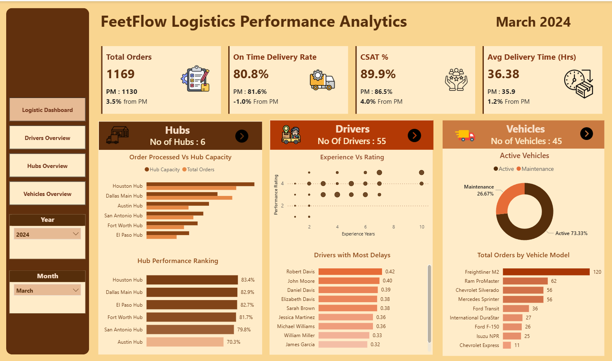
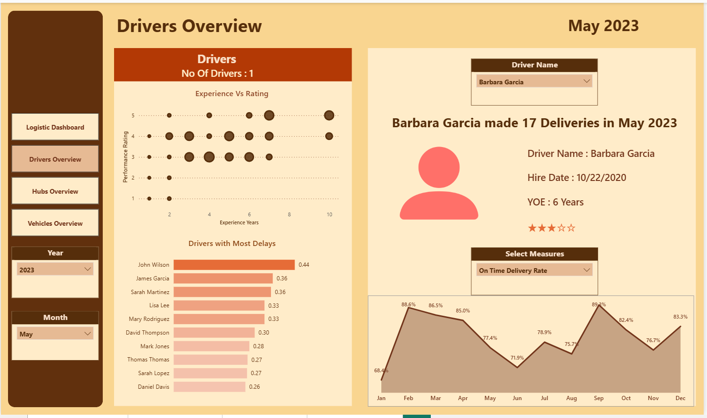
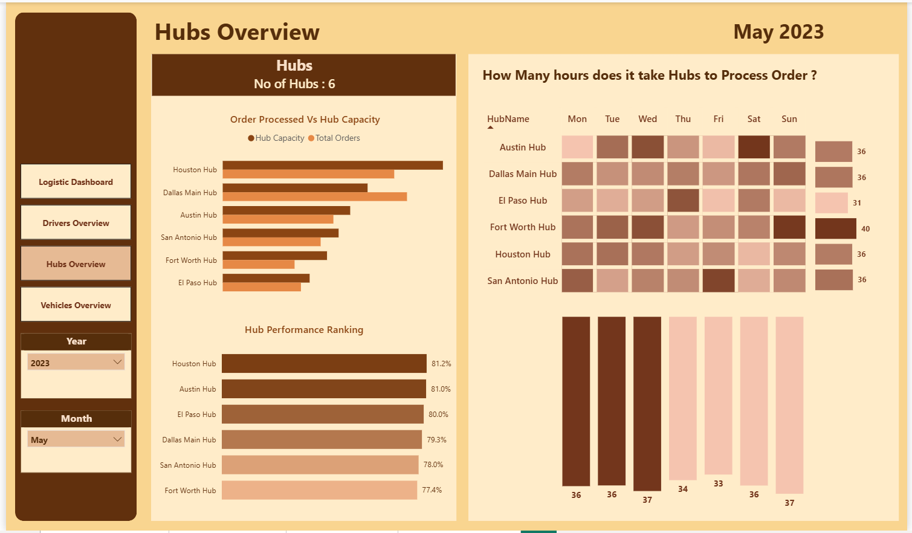
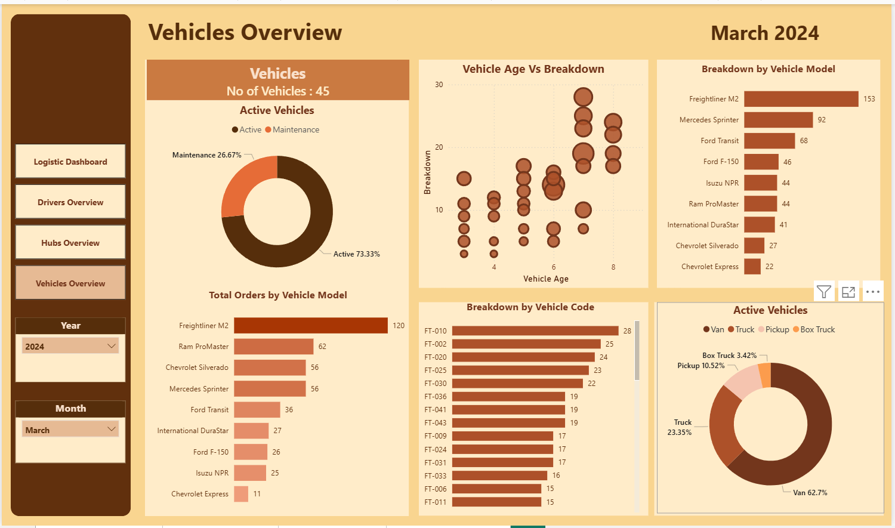

# 🚚 FeetFlow Logistics — End-to-End Analytics Project

> A complete data analytics portfolio project covering logistics performance across 6 hubs, 55 drivers, and 45 vehicles over a 2-year period.


---

## 📌 Project Overview

FeetFlow is a fictional logistics company operating 6 distribution hubs across Texas. This project analyses **27,979 delivery orders** from **January 2023 to December 2024** to answer real operational questions about hub efficiency, delay root causes, driver performance, vehicle reliability, and customer satisfaction.

This is not just a dashboard project. It covers the complete analyst workflow:

```
Raw CSV Data  →  Python Cleaning & EDA  →  SQL Business Queries  →  Power BI Dashboard  →  Business Insights
```

---

## 🎯 Business Problem

Logistics companies live and die by two metrics: **on-time delivery rate** and **customer satisfaction (CSAT)**. FeetFlow's operations team needs to understand:

1. Which hubs are underperforming, and why?
2. What is causing delays — and which causes can actually be fixed?
3. Does driver experience predict delivery performance?
4. Is vehicle age creating a hidden maintenance burden?
5. What is the single biggest lever to improve customer satisfaction?

---

## 📊 Dashboard Preview

| Logistics Dashboard | Drivers Overview |
|---|---|
|  |  |

| Hubs Overview | Vehicles Overview |
|---|---|
|  |  |

> Built in **Power BI** with 4 interactive pages, cross-page filtering by Year and Month, and custom brown/tan brand theme.

---

## 🗂️ Repository Structure

```
feetflow-logistics-analytics/
│
├── 📁 data/
│   ├── Orders.csv          # 27,979 rows — core fact table
│   ├── Drivers.csv         # 55 driver profiles with ratings
│   ├── Hubs.csv            # 6 hub locations with capacity
│   └── Vehicles.csv        # 45 vehicles with maintenance records
│
├── 📁 notebooks/
│   └── FeetFlow_EDA.ipynb  # Full EDA — cleaning, features, correlations, charts
│
├── 📁 sql/
│   └── feetflow_business_queries.sql  # 10 SQL queries with business context
│
├── 📁 dashboard/
│   └── FeetFlow.pbix       # Power BI dashboard file
│
├── 📁 screenshots
│   └── *.png               # Dashboard screenshots for README
│
└── README.md
```

---

## 📁 Dataset

| Table | Rows | Key Columns |
|---|---|---|
| `Orders.csv` | 27,979 | Order Date, Hub Name, Driver ID, Vehicle Type, Is Delayed, Delay Reason, CSAT Score, Delivery Time Hours |
| `Drivers.csv` | 55 | Driver Name, Employment Type, Hire Date, Experience Years, Performance Rating |
| `Hubs.csv` | 6 | Hub Name, Hub Capacity |
| `Vehicles.csv` | 45 | Vehicle Model, Vehicle Status, Purchase Date, Breakdown count, Maintenance Alert |

**Period covered:** January 2023 – December 2024  
**Geography:** Texas, USA (Houston, Dallas, Austin, San Antonio, Fort Worth, El Paso)

### Data Quality Notes

- `Delay Reason` is intentionally NULL for non-delayed orders (22,071 nulls are valid)
- `Actual Delivery Date` is NULL for 252 cancelled orders — excluded from delivery time analysis
- No duplicate Order IDs, Driver IDs, or Vehicle IDs found
- All date columns parsed from `dd/mm/yyyy` format

---

## 🐍 Python EDA (`FeetFlow_EDA.ipynb`)

The notebook covers 12 sections across the full analyst workflow:

| Section | What it does |
|---|---|
| 1. Setup & Loading | Libraries, colour palette, loading all 4 CSVs |
| 2. Data Cleaning | Null audit, date parsing, duplicate checks, range validation |
| 3. Feature Engineering | Vehicle age (derived), driver delay rate (derived), time features |
| 4. Univariate Analysis | Distribution plots for key variables |
| 5. Hub Performance | On-time rate, CSAT, and utilisation by hub |
| 6. Driver Analysis | Leaderboard, experience vs performance scatter |
| 7. Vehicle Analysis | Age vs breakdowns, fleet composition |
| 8. Delay Root Causes | Controllable vs external breakdown, day-of-week analysis |
| 9. CSAT Analysis | Delivery time buckets, delayed vs on-time gap |
| 10. Correlation Analysis | Pearson r heatmaps with p-values |
| 11. Time Series | Monthly trend with rolling average, YoY comparison |
| 12. Findings Summary | Structured print of all key findings |

**Libraries used:** `pandas`, `numpy`, `matplotlib`, `seaborn`, `scipy`

### To run the notebook

```bash
# Clone the repo
git clone https://github.com/yourusername/feetflow-logistics-analytics.git
cd feetflow-logistics-analytics

# Install dependencies
pip install pandas numpy matplotlib seaborn scipy jupyter

# Launch notebook
jupyter notebook notebooks/FeetFlow_EDA.ipynb
```

> The CSV files use UTF-16 encoding (Power BI export format). The notebook handles this automatically.

---

## 🗃️ SQL Queries (`feetflow_business_queries.sql`)

10 production-quality queries written in standard SQL, compatible with PostgreSQL, MySQL 8+, SQLite, SQL Server, and BigQuery.

| # | Query | Business Question | Key Techniques |
|---|---|---|---|
| 01 | Hub Performance Scorecard | Which hubs rank highest overall? | `RANK()`, `CASE WHEN`, window functions |
| 02 | Hub Capacity Utilisation | Which hubs have room to grow? | CTE, ratio derivation |
| 03 | Monthly OTD & CSAT Trend | How has performance trended MoM? | `LAG()`, rolling average with `ROWS BETWEEN` |
| 04 | Year-over-Year Hub Comparison | Which hubs improved in 2024? | Self-join on CTE, YoY delta |
| 05 | Delay Root Cause by Hub | What's causing delays at each hub? | `PARTITION BY`, controllable/external classification |
| 06 | Driver Performance Leaderboard | Who are the best and worst drivers? | `NTILE()`, `HAVING`, outlier flagging |
| 07 | CSAT Driver Analysis | What most affects customer satisfaction? | `UNION ALL`, delivery time bucketing |
| 08 | Vehicle Breakdown Risk | Which vehicles need attention now? | Composite risk score, peer benchmarking |
| 09 | Fleet Maintenance Status | What is our effective fleet capacity? | `UNION ALL` totals, multi-condition aggregation |
| 10 | Executive KPI Summary | What are the headline numbers? | `CROSS JOIN`, `NULLIF`, full-period narrative |

---

## 📈 Key Findings

### Finding 1 — Vehicle age is the strongest predictor of breakdowns
> Pearson r = **0.650**, p < 0.001

Older vehicles break down significantly more often. With **26.7% of the fleet** (12 of 45 vehicles) currently in maintenance at any given time, this represents a major operational constraint. Every additional year of vehicle age adds approximately 3–4 breakdown events.

**Recommendation:** Set a proactive replacement threshold at 5+ years. Prioritise the highest-risk vehicles (age × breakdown score) in the next procurement cycle.

---

### Finding 2 — Delivery time is the key CSAT driver
> Pearson r = **-0.287**, p < 0.001

The faster the delivery, the higher the satisfaction — and the relationship is statistically significant across all 27,727 delivered orders. Delayed orders score measurably lower on CSAT than on-time orders across every hub and vehicle type.

**Recommendation:** Reducing the delay rate is the highest-leverage action available to lift CSAT. Even a 1 percentage point improvement in on-time rate will have a measurable customer satisfaction impact.

---

### Finding 3 — Nearly half of all delays are internally controllable
> **49.4%** of delays come from internal operational causes

The top 10 delay reasons split into two categories:

| Internal (Controllable) | External (Uncontrollable) |
|---|---|
| Package Sorting Error | Road Construction |
| Driver Unavailable | Severe Weather |
| Hub Processing Delay | Traffic Congestion |
| Incorrect Address | Customer Not Home |
| Multiple Delivery Stops | Vehicle Breakdown |

**Recommendation:** Process improvements in package sorting, hub scheduling, and address verification offer the highest ROI for on-time rate gains. External causes require contingency planning, not process change.

---

### Finding 4 — Driver experience does NOT predict delay rate
> Pearson r = **0.182**, p = 0.184 — *not statistically significant*

More experienced drivers do not delay less. The best performers (lowest delay rates) span 1–7 years of experience, and the worst performers include both junior and senior drivers.

**Recommendation:** Delays are driven by hub conditions and route complexity, not individual driver tenure. Route optimisation and hub-level process improvement will outperform driver-focused interventions.

---

### Finding 5 — El Paso Hub is the benchmark; Austin Hub needs attention

| Hub | On-Time Rate | Orders | Rank |
|---|---|---|---|
| El Paso Hub | **81.2%** | 2,697 | 🥇 1st |
| Houston Hub | 79.9% | 6,807 | 2nd |
| Dallas Main Hub | 79.6% | 7,282 | 3rd |
| San Antonio Hub | 79.5% | 3,685 | 4th |
| Fort Worth Hub | 79.0% | 3,235 | 5th |
| Austin Hub | **78.7%** | 4,021 | 🔴 6th |

El Paso Hub achieves the best on-time rate with the smallest volume. Austin Hub underperforms despite moderate volume and above-average capacity.

**Recommendation:** Conduct an operational audit of Austin Hub using El Paso Hub's processes as a benchmark. Day-of-week analysis confirms delays are not scheduling-driven (range: 20.6–21.6%), pointing to operational root causes.

---

## 🛠️ Tools & Technologies

| Tool | Purpose |
|---|---|
| **Power BI** | 4-page interactive dashboard with cross-filtering |
| **Python 3** | Data cleaning, EDA, feature engineering, visualisation |
| **pandas / numpy** | Data manipulation and derived column creation |
| **matplotlib / seaborn** | Statistical charts and correlation heatmaps |
| **scipy.stats** | Pearson correlation with p-value significance testing |
| **SQL (SQLite/PostgreSQL)** | 10 business queries with window functions and CTEs |

---

## 💡 What Makes This Project Different

Most logistics dashboard portfolios stop at the visuals. This project goes further:

- **Statistical validation** — findings include correlation coefficients and p-values, not just chart observations
- **Counterintuitive insight** — driver experience *doesn't* predict performance (r = 0.18, p = 0.18), which is a more valuable finding than confirming the obvious
- **Business framing** — every finding is paired with a concrete recommendation, not just a data observation
- **Controllability classification** — delay reasons are categorised by whether they can be operationally fixed, giving the analysis immediate business utility
- **Full workflow** — raw CSV → Python cleaning → SQL analysis → Power BI dashboard → written recommendations

---

## 📬 Contact

**[Your Name]**  
Data Analyst  
📧 your.email@gmail.com  
🔗 [LinkedIn](https://linkedin.com/in/yourprofile)  
🌐 [Portfolio](https://yourportfolio.com)

---

*Dataset is fictional and created for portfolio purposes. All company names, hub locations, and driver names are synthetic.*
